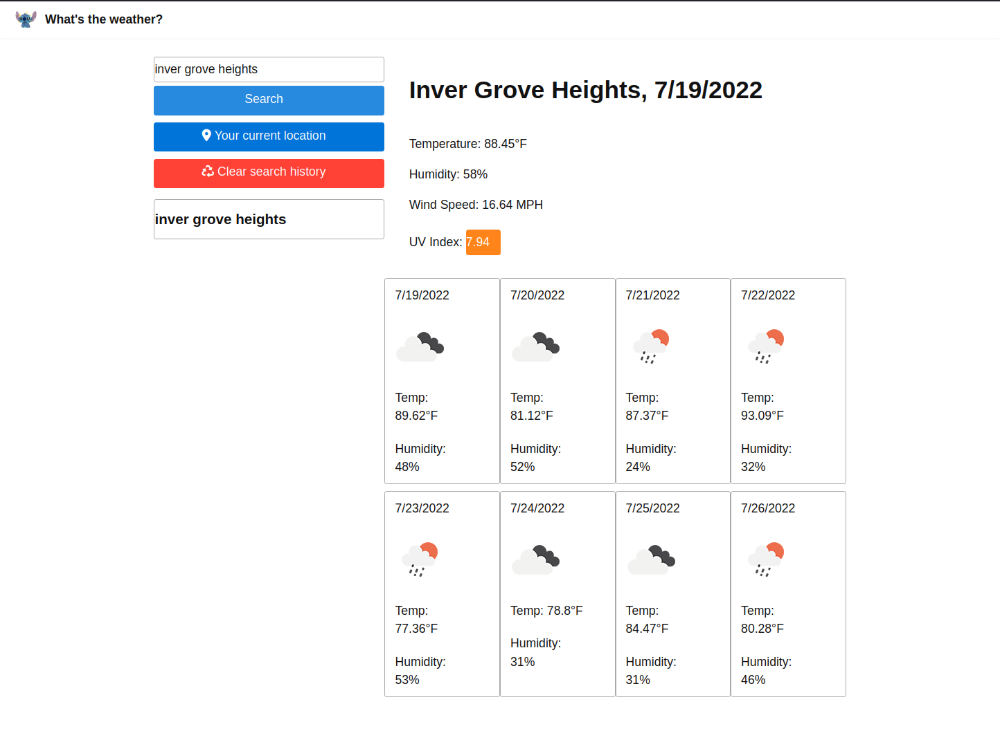

# Ideal Weather Dashboard
This is the ideal weather dashboard.

## About the project
This project was created to display the current weather with UV index, tempurature, and a couple other goodies as well as a forecast of the next eight days. You can also use your current location if you couldn't be bothered to know what city you're currently in. (We've all been there!)

## Project Criteria

- When a city is searched, current and future conditions are displayed, and the city is added to the search history.
- When the UV index is displayed, there is logic styling the UV index in accordance with how concerning it is.  
- When the forecast is displayed, id displays the forecasted tempurature, humidity, and an icon representing the conditions.
- When a city is clicked in the search history, it loads up the current weather, and future forecast for that city.

## Screenshots!

## Deployment of project
Please access the deployed GitHub pages link [here!](https://fixedotter.github.io/idealWeatherDashboard/)